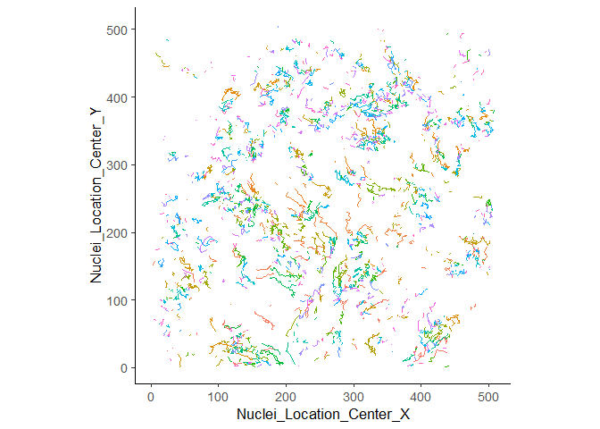

<!-- README.md is generated from README.Rmd. Please edit that file -->

# CPTrackR

<!-- badges: start -->

<!-- badges: end -->

The goal of CPTrackR is to add unique track ids to CellProfiler tracking
output.

**NB:** No support for LAP tracking with temporal gaps (yet)

## Installation

You can install the development version of CPTrackR with:

``` r
remotes::install_github("burgerga/CPTrackR")
```

## Usage

### Creating a lookup table (LUT)

Assuming `data` contains some data from a CellProfiler tsv:

Show some example uncorrected data:

``` r
library(tidyverse)
data %>%
  select(groupNumber, 
         groupInd, 
         Nuclei_TrackObjects_ParentObjectNumber_30, 
         Nuclei_Number_Object_Number,
         Nuclei_Intensity_MeanIntensity_image_green)
#> # A tibble: 370,598 x 5
#>    groupNumber groupInd Nuclei_TrackObject~ Nuclei_Number_Ob~ Nuclei_Intensity_~
#>          <dbl>    <dbl>               <dbl>             <dbl>              <dbl>
#>  1           1        1                   0                 1          0.000135 
#>  2           1        1                   0                 2          0.0000847
#>  3           1        1                   0                 3          0.000223 
#>  4           1        1                   0                 4          0.000110 
#>  5           1        1                   0                 5          0.000952 
#>  6           1        1                   0                 6          0.00346  
#>  7           1        1                   0                 7          0.0000498
#>  8           1        1                   0                 8          0.000108 
#>  9           1        1                   0                 9          0.00982  
#> 10           1        1                   0                10          0.000639 
#> # ... with 370,588 more rows
```

We can create a lookup table (LUT) for a single group using
`createLUTGroup`:

``` r
library(CPTrackR)
lut <- createLUTGroup(data %>% filter(groupNumber == 1),
                      frame_var = groupInd, 
                      obj_var = Nuclei_Number_Object_Number,
                      par_obj_var = Nuclei_TrackObjects_ParentObjectNumber_30) 
lut %>% 
  arrange(Nuclei_Number_Object_Number, groupInd)
#> # A tibble: 10,304 x 5
#>    groupInd Nuclei_Number_Object_Number   cid   uid alt_uid
#>       <dbl>                       <dbl> <dbl> <dbl> <chr>  
#>  1        1                           1     1     1 1      
#>  2        2                           1     1     1 1      
#>  3        3                           1     1     1 1      
#>  4        4                           1     1     1 1      
#>  5        5                           1   271   344 271    
#>  6        6                           1     1     1 1      
#>  7        7                           1   315   444 315    
#>  8        8                           1   252   311 252    
#>  9        9                           1   252   311 252    
#> 10       10                           1   252   311 252    
#> # ... with 10,294 more rows
```

Three new columns are added:

  - `cid`: id of the original cell (daughter cells share `cid` with
    parent)
  - `uid`: unique id (daughter cells don’t share `uid` with parent)
  - `alt_uid`: character id of cells that show lineage with suffixes

For illustration here the second frame, where we can see `alt_uid`s for
daughter cells:

``` r
lut %>% 
  filter(groupInd == 2) %>%
  arrange(Nuclei_Number_Object_Number, groupInd)
#> # A tibble: 200 x 5
#>    groupInd Nuclei_Number_Object_Number   cid   uid alt_uid
#>       <dbl>                       <dbl> <dbl> <dbl> <chr>  
#>  1        2                           1     1     1 1      
#>  2        2                           2     3   240 3.1    
#>  3        2                           3     3   241 3.2    
#>  4        2                           4     5     5 5      
#>  5        2                           5     6     6 6      
#>  6        2                           6    14   242 14.1   
#>  7        2                           7     9     9 9      
#>  8        2                           8    10    10 10     
#>  9        2                           9    11    11 11     
#> 10        2                          10    13    13 13     
#> # ... with 190 more rows
```

We can also enable a progress bar (will be visible if you run this code
in R):

``` r
library(progressr)
with_progress({
  lut <- createLUTGroup(data %>% filter(groupNumber == 1),
                        frame_var = groupInd, 
                        obj_var = Nuclei_Number_Object_Number,
                        par_obj_var = Nuclei_TrackObjects_ParentObjectNumber_30) 
})
lut %>% 
  arrange(Nuclei_Number_Object_Number, groupInd)
#> # A tibble: 10,304 x 5
#>    groupInd Nuclei_Number_Object_Number   cid   uid alt_uid
#>       <dbl>                       <dbl> <dbl> <dbl> <chr>  
#>  1        1                           1     1     1 1      
#>  2        2                           1     1     1 1      
#>  3        3                           1     1     1 1      
#>  4        4                           1     1     1 1      
#>  5        5                           1   271   344 271    
#>  6        6                           1     1     1 1      
#>  7        7                           1   315   444 315    
#>  8        8                           1   252   311 252    
#>  9        9                           1   252   311 252    
#> 10       10                           1   252   311 252    
#> # ... with 10,294 more rows
```

We can create a LUT for multiple groups (=movies) using `createLut`, the
`group_vars` are used to denote the different groups (can be multiple
columns):

``` r
with_progress({
  lut_all <- createLUT(data, 
                       group_vars = groupNumber, 
                       frame_var = groupInd, 
                       obj_var = Nuclei_Number_Object_Number, 
                       par_obj_var = Nuclei_TrackObjects_ParentObjectNumber_30) 
})
lut_all 
#> # A tibble: 370,598 x 6
#>    groupNumber groupInd Nuclei_Number_Object_Number   cid   uid alt_uid
#>          <dbl>    <dbl>                       <dbl> <dbl> <dbl> <chr>  
#>  1           1        1                           1     1     1 1      
#>  2           1        1                           2     2     2 2      
#>  3           1        1                           3     3     3 3      
#>  4           1        1                           4     4     4 4      
#>  5           1        1                           5     5     5 5      
#>  6           1        1                           6     6     6 6      
#>  7           1        1                           7     7     7 7      
#>  8           1        1                           8     8     8 8      
#>  9           1        1                           9     9     9 9      
#> 10           1        1                          10    10    10 10     
#> # ... with 370,588 more rows
```

Now we can join the LUT to the original data

``` r
fixed <- data %>% 
  left_join(lut_all) 
#> Joining, by = c("groupInd", "groupNumber", "Nuclei_Number_Object_Number")
fixed %>%
  select(groupNumber, groupInd, uid, alt_uid, Nuclei_Intensity_MeanIntensity_image_green)
#> # A tibble: 370,598 x 5
#>    groupNumber groupInd   uid alt_uid Nuclei_Intensity_MeanIntensity_image_green
#>          <dbl>    <dbl> <dbl> <chr>                                        <dbl>
#>  1           1        1     1 1                                        0.000135 
#>  2           1        1     2 2                                        0.0000847
#>  3           1        1     3 3                                        0.000223 
#>  4           1        1     4 4                                        0.000110 
#>  5           1        1     5 5                                        0.000952 
#>  6           1        1     6 6                                        0.00346  
#>  7           1        1     7 7                                        0.0000498
#>  8           1        1     8 8                                        0.000108 
#>  9           1        1     9 9                                        0.00982  
#> 10           1        1    10 10                                       0.000639 
#> # ... with 370,588 more rows
```

#### Parallelisation

We can also enable parallelisation using the `future` package and
specifying a `plan`, this will give a considerable speed improvement if
you have many movies:

``` r
library(future)
plan(multisession)
with_progress({
  lut_all <- createLUT(data, 
                       group_vars = groupNumber, 
                       frame_var = groupInd, 
                       obj_var = Nuclei_Number_Object_Number, 
                       par_obj_var = Nuclei_TrackObjects_ParentObjectNumber_30) 
})
lut_all
```

    #> # A tibble: 370,598 x 6
    #>    groupNumber groupInd Nuclei_Number_Object_Number   cid   uid alt_uid
    #>          <dbl>    <dbl>                       <dbl> <dbl> <dbl> <chr>  
    #>  1           1        1                           1     1     1 1      
    #>  2           1        1                           2     2     2 2      
    #>  3           1        1                           3     3     3 3      
    #>  4           1        1                           4     4     4 4      
    #>  5           1        1                           5     5     5 5      
    #>  6           1        1                           6     6     6 6      
    #>  7           1        1                           7     7     7 7      
    #>  8           1        1                           8     8     8 8      
    #>  9           1        1                           9     9     9 9      
    #> 10           1        1                          10    10    10 10     
    #> # ... with 370,588 more rows

### Plotting

With our `uid` per cell we can now plot the tracks:

``` r
ggplot(fixed %>% filter(groupNumber == 1), 
       aes(Nuclei_Location_Center_X, Nuclei_Location_Center_Y, 
           group = uid, color = as.factor(uid))) + 
  geom_path() + 
  guides(color = F) +
  coord_fixed()
```


